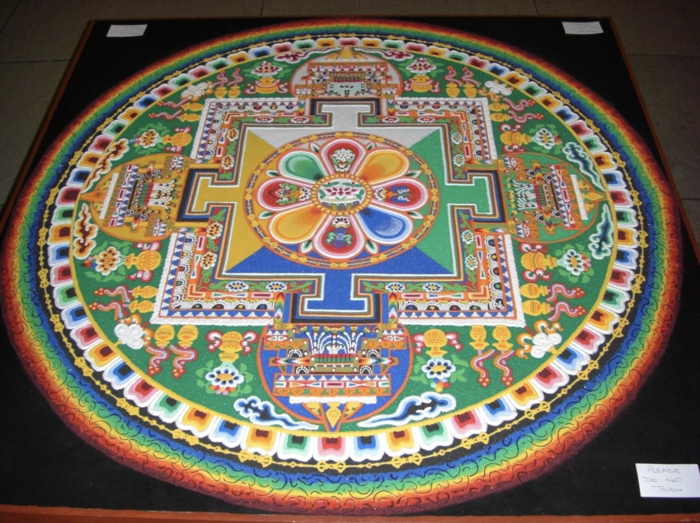
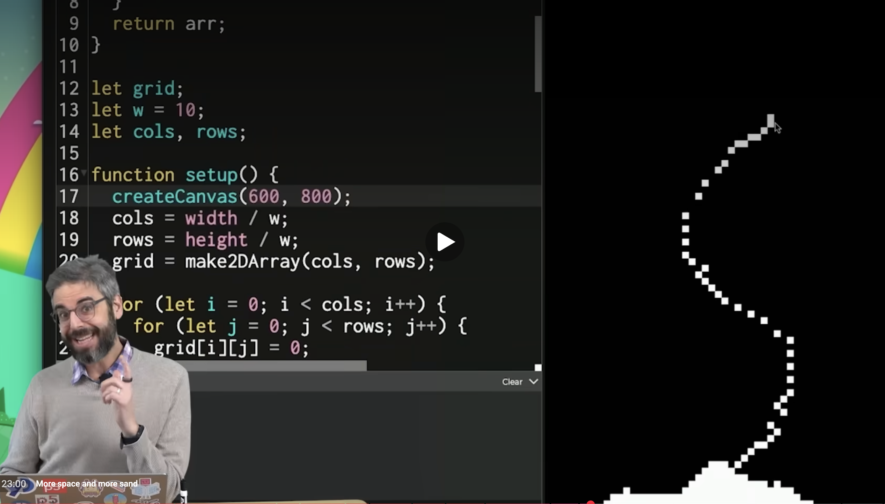
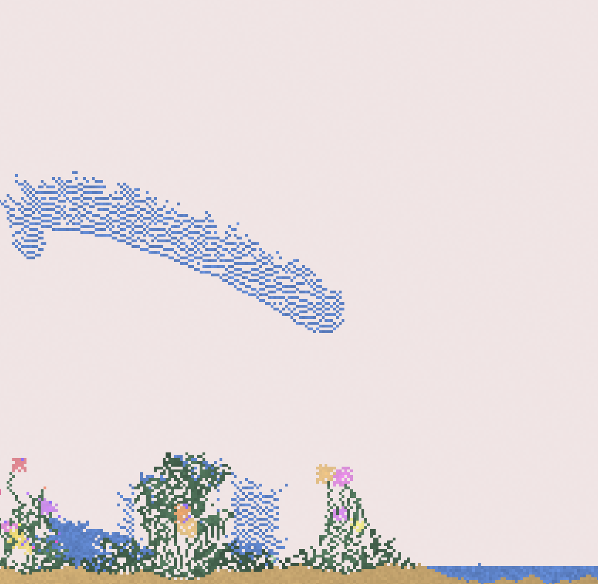
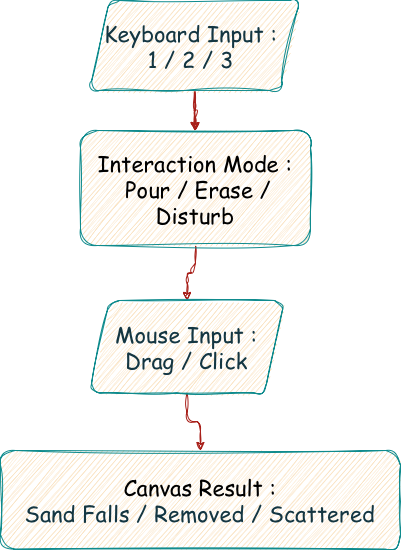
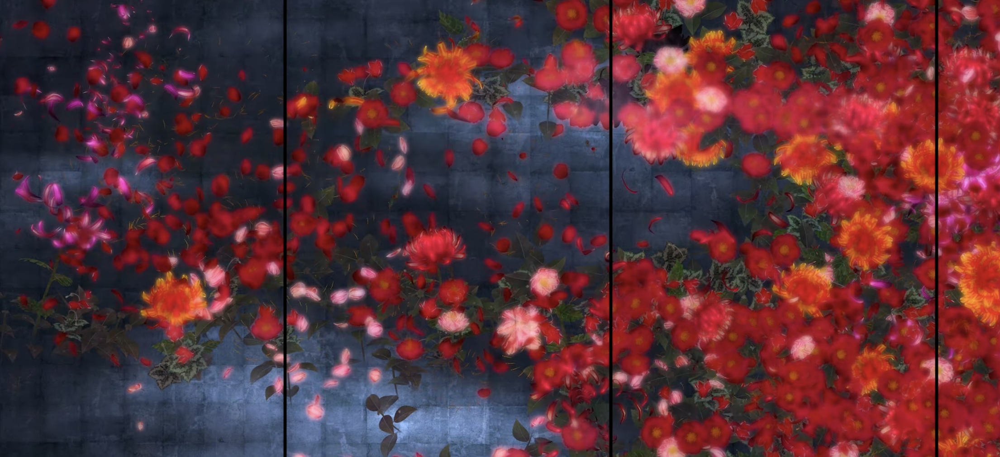
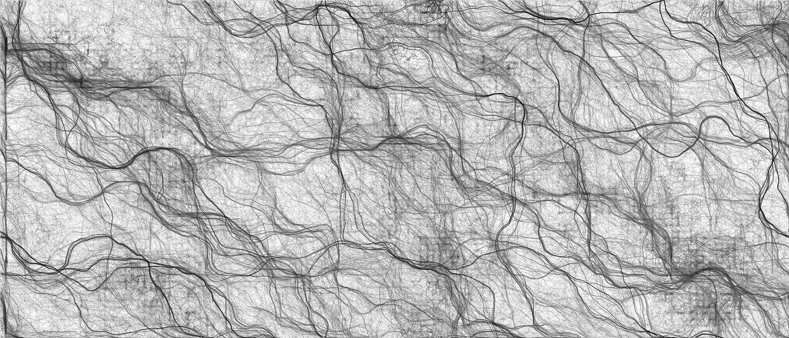

# Quiz9_Final Project Team - 1

## Project Title
**Dissolving Sandscape** *(tentative)*

---

## Part 1: Project Direction

### Chosen Path

Our team has chosen **Option 2: Create an original piece**.

### Team Vision

**Dissolving Sandscape** is an interactive visual work about temporary beauty, digital material, and disappearance. The piece begins as a blank dark canvas where users can pour and shape falling sand. Over time, the sand slowly forms a fragile landscape or abstract sand painting. However, the work is not meant to stay fixed. Audio changes the colour and energy of the sand, time moves the piece through stages of building and dissolving, and Perlin noise creates wind-like erosion. Our concept is inspired by Tibetan sand mandalas, where creation and destruction are both part of the artwork, and by falling-sand simulations such as The Coding Train’s **Falling Sand** and Max Bittker’s **Sandspiel**. We want the final piece to feel alive, unstable, and temporary: a sand image that the audience helps create, then watches disappear.

*Figure 1. Tibetan sand mandala reference. Source: Minneapolis Institute of Art, [The Tibetan Sand Mandala: A Short History](https://new.artsmia.org/hub/programming-events/tibetan-sand-mandala-history).*

*Figure 2. Falling sand simulation reference. Source: The Coding Train, [**Coding Challenge #180: Falling Sand**](https://thecodingtrain.com/challenges/180-falling-sand/). Example code: [p5.js Web Editor](https://editor.p5js.org/codingtrain/sketches/AoH40T6fV).*

*Figure 3. Interactive falling-sand sandbox reference. Source: Max Bittker, [**Sandspiel**](https://sandspiel.club/). Additional project page: [Sandspiel on itch.io](https://maxbittker.itch.io/sandspiel).*

---

## Part 2: Mechanics

| Team Member | Mechanic |
|---|---|
| Jialu Li | User input | 
| Junhao Fan | Audio |
| Jiajun Zhao | Time-based | 
| Runcheng Tian | Perlin noise and randomness | 

---

### Mechanic 1: User Input — Sand Pouring and Destruction

My mechanism is responsible for User Input, allowing the audience to directly shape the sand painting through the mouse and keyboard. Users can drag the mouse to release colored sand onto the canvas, creating lines, piles, or hills. Mouse movement affects where the sand appears, making the interaction feel more like pouring sand by hand. Users can also click or drag to break, erase, or disturb existing sand structures. The keyboard switches between modes, such as Pour, Erase, and Disturb. This connects to the project’s theme of temporary beauty, because the audience becomes both creator and destroyer, building a sandscape while also watching it change, collapse, and disappear.

*Figure 4. Diagram showing how keyboard and mouse inputs control the sand interaction modes and canvas results.*

---

### Mechanic 2: Audio — Colour and Energy Response

For the audio mechanic, my idea is that audio begins to play while the sand particles are falling. As time passes, the sand changes its colour and movement trajectory according to the amplitude of the sound. When the volume is low, the sand appears darker, softer, and more stable. As the volume increases, the sand becomes brighter, more saturated, and more active in its movement. If frequency analysis is used, lower frequencies could generate warmer colours, while higher frequencies could create sharper or brighter colours. The addition of this audio mechanic makes the falling sand feel more alive and dynamic, increasing interactivity while also creating visually appealing effects.

*Figure 5. Diagram of audio amplitude controlling sand colour and brightness.*

---

### Mechanic 3: Time-Based — Building, Settling, and Dissolving Phases

The time-based mechanic controls the life cycle of the artwork. It is inspired by Tibetan sand mandalas, where a carefully created sand image is eventually dissolved, and by teamLab’s time-based digital installations, where flowers grow, bloom, scatter, and die over time. In our project, time is not just a timer; it becomes a visual force that changes the state of the sand painting. During the building phase, users can freely pour sand with the mouse. After a set duration, the sand enters a settling phase and becomes slower and more stable. Then the dissolving phase begins, where the sand starts to fade, drift, and lose its structure. In the final collapse or reset phase, users can click to break the image apart. This connects to our project vision because the artwork is designed to be temporary: it is created, briefly completed, and then inevitably disappears.

*Figure 6. Time-based digital installation reference. Source: teamLab, [**Flowers and People − A Whole Year per Hour**](https://www.teamlab.art/w/flowersandpeople-hour/), where flowers grow, bloom, scatter, and wither over time.*

---

### Mechanic 4: Perlin Noise and Randomness — Wind Erosion

My mechanic focuses on using **Perlin noise and randomness** to create a natural "wind erosion" effect for the sandscape. Unlike standard random values that can appear harsh or disjointed, Perlin noise allows for smooth and continuous variations where each value is related to its neighbors. This makes it the perfect tool for simulating how sand might drift or swirl across the canvas in a realistic way. To implement this, I plan to use a noise function that samples values over time to slightly offset the position of the sand particles. By incrementing this sampling position every frame, the sand will appear to be pushed by a smooth, invisible current rather than just falling in a straight, mechanical line.

This mechanic is essential for our vision of **temporary beauty**. As the artwork settles, the influence of the noise will create an unpredictable but graceful movement, causing the sand to gradually "erode" and fade away. This reflects the organic decay seen in a real-world sand mandala, where even the most detailed creation is eventually reclaimed by nature. It ensures the final piece feels alive and constantly changing, reinforcing the idea that our digital sandscape is a fragile and impermanent experience.

*Figure 7. Sketch of Perlin-noise wind pushing sand particles across the canvas,inspired by the Perlin Noise Flow Field experiment by Raging Nexus. Available at: [Perlin Noise - Flow Field](https://ragingnexus.com/creative-code-lab/experiments/perlin-noise-flow-field/)*

---

## Part 3: Putting It Together

All mechanics will share one canvas and one sand-particle system. User input creates and disturb the sand, audio changes its colour and energy, time controls the artwork’s phases, and Perlin noise gradually erodes the image. The project is held together by the concept of temporary sand painting: every interaction adds material, but every material form is unstable. Visually, the work will use a dark background, bright coloured sand, and soft fading trails, making the canvas feel like a glowing digital sand table. The final piece should feel interactive, fragile, and constantly changing.

---

## References and Inspirations

- Minneapolis Institute of Art. [*The Tibetan Sand Mandala: A Short History*](https://new.artsmia.org/hub/programming-events/tibetan-sand-mandala-history).  
  Inspiration for the theme of impermanence and temporary sand-based artwork.

- The Coding Train. [*Coding Challenge 180: Falling Sand*](https://www.youtube.com/results?search_query=The+Coding+Train+Coding+Challenge+180+Falling+Sand).  
  Coding reference for simulating falling sand particles in p5.js.

- Max Bittker. [*Sandspiel*](https://maxbittker.itch.io/sandspiel).  
  Inspiration for interactive falling-sand gameplay and pixel-based material simulation.

- teamLab. [*Universe of Water Particles*](https://www.teamlab.art/w/uowp/).  
  Visual inspiration for particle movement, flow, and immersive digital environments.

- teamLab. [*Flowers and People – A Whole Year per Hour*](https://www.teamlab.art/w/flowersandpeople-hour/).  
  Inspiration for the time-based mechanic, especially the idea of using time to move a digital artwork through growth, completion, scattering, and decay.  

- Raging Nexus. [*Perlin Noise - Flow Field*](https://ragingnexus.com/creative-code-lab/experiments/perlin-noise-flow-field/).  
  Coding reference for Perlin-noise-driven movement and wind-like particle flow.
